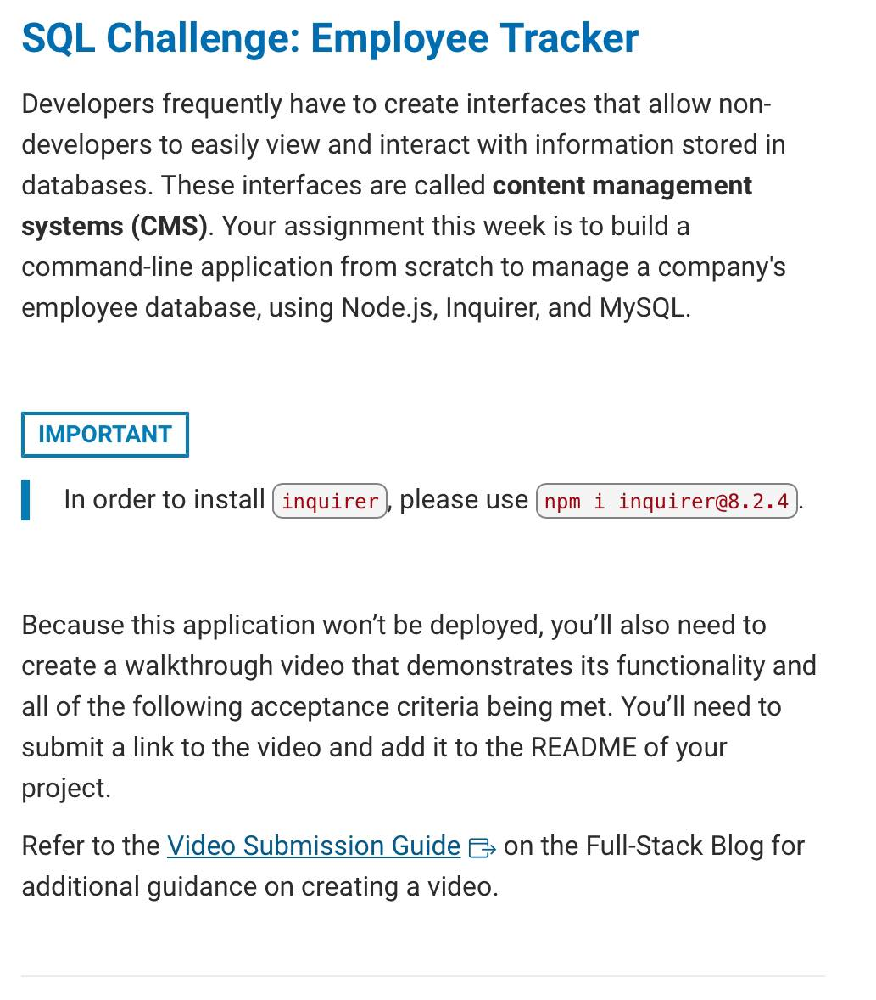

# challenge-twelve-employee-tracker-mysql-project
A command line application to manage a company's employee database, featuring Node.js, Inquirer 8.2.4, and MySQL.

## Description

A command-line application designed to help manage and organize company's employee data, Featuring Node.js, Inquirer 8.2.4, and MySQL, this tool provides options to view, add, and update info about departments, roles, and employees. Features: View departments, roles, and employees. Add new departments, roles, and employees. Update existing employee roles.

Notes:
Node.js: runs the application.
Inquirer 8.2.4: Makes the command-line interactive (will ask for user input/choices) 8.2.4, is the verison of Inquirer I'm using.
MySQL: Will store and manage all employee data.
MySQL2: Bridge between Node.js and MySQL. Its promise-based, which will make it easier to use for asynchronous operations. It will help send requests to database & return data back.

Startup:
On launching the application, users are greeted with the following options:

- View all departments
- View all roles
- View all employees
- Add a department
- Add a role
- Add an employee
- Update an employee role

1. View All Departments:
Choosing this will display a formatted table with department names and their respective ids.

2. View All Roles:
This option provides users with detailed information about each role:
job title, role id, department, and salary.

3. View All Employees:
Lists all employees:
ids, first names, last names, job titles, departments, salaries, and managers they report to.

4. Add Department:
Add a new department to the database.

5. Add Role:
Users need to specify the role's name, its salary, and the associated department.

6. Add Employee:
When adding an employee:
user is prompted for their first name, last name, their role, and their manager.

7. Update Employee Role:
Allows users to update the role of an existing employee.

I was also given a mock image, of what project should look like, which I have included in this Readme. (In Table of Contents, should be under School Instructions.)

Links to my Youtube video demonstration are located in the links ( second in Table of Contents )

## Table of Contents

:bookmark_tabs:

- [Installation](#installation)
- [Links](#links)
- [School Instructions](#school-instructions)
- [CLI-TABLE3](#cli-table3)
- [MYSQL](#mysql)
- [INQUIRER 8.2.4](#inquirer-824)
- [DOTENV](#dotenv)
- [CHALK](#chalk)
- [MYSQL2](#mysql)
- [MISC](#misc)
- [Console Table](#console-table)
- [Notes on Application](#notes-on-application)
- [My Own Personal Notes](#my-own-personal-notes)
- [Mysql hw](#mysql-hw)
- [License](#license)
- [How to Contribute](#how-to-contribute)
- [Credits](#credits)
- [Badges](#badges)
- [Tests](#tests)
- [Features](#features)

## Installation

To ensure smooth execution:

- Make sure you have Node.js and MySQL installed.
- Clone the repository.
- Navigate to the directory and run

        npm install

- to install the necessary packages.
- For Inquirer, use the command:          npm i inquirer@8.2.4

:arrow_down:

:arrow_forward: [Github Link : Click Me To Go To Link](https://github.com/pmastropolo/challenge-twelve-employee-db-database-mysql-project)

:arrow_forward: [Youtube Video : Click Me To Go To Link](https://www.youtube.com/watch?v=Lo4xbWoiPC0)

## Links

:open_file_folder:

:arrow_forward: Github link: https://github.com/pmastropolo/challenge-twelve-employee-db-database-mysql-project

:arrow_forward: Youtube Video: https://www.youtube.com/watch?v=Lo4xbWoiPC0

## School Instructions

## CLI-TABLE3

What is it?
Node.js library used for creating formatted tables in command line interface (CLI).
Allows developers to generate tables with custom styling/formatting options.

Installation:
npm install cli-table3

Initialization:
const Table = require('cli-table3');

Links:

[Cli Table](https://www.npmjs.com/package/cli-table3)

## MYSQL

- [Chapter 4 Getting Started with MySQL Shell](https://dev.mysql.com/doc/mysql-shell/8.0/en/mysql-shell-getting-started.html)
- [MYSQL](https://www.mysql.com/)
- [Creating and Selecting a Database](https://dev.mysql.com/doc/refman/8.0/en/creating-database.html)
- [What Is MySQL](https://www.mysqltutorial.org/what-is-mysql/)
- [Understanding Relational Databases](https://www.digitalocean.com/community/tutorials/understanding-relational-databases)
- [An Introduction to Queries in MySQL](https://www.digitalocean.com/community/tutorials/introduction-to-queries-mysql)
- [MySQL What is DDL, DML and DCL?](https://www.w3schools.in/mysql/ddl-dml-dcl)
- [Create, read, update and delete](https://en.wikipedia.org/wiki/Create,_read,_update_and_delete)
- [Creating a Table](https://dev.mysql.com/doc/refman/8.0/en/creating-tables.html)
- [SELECT Statement](https://dev.mysql.com/doc/refman/8.0/en/select.html)
- [INSERT Statement](https://dev.mysql.com/doc/refman/8.0/en/insert.html)
- [UPDATE Statement](https://dev.mysql.com/doc/refman/8.0/en/update.html)
- [DELETE Statement](https://dev.mysql.com/doc/refman/8.0/en/delete.html)
- [Data Types](https://dev.mysql.com/doc/refman/8.0/en/data-types.html)
- [Loading Data into a Table](https://dev.mysql.com/doc/refman/8.0/en/loading-tables.html)
- [PRIMARY KEY and UNIQUE Index Constraints](https://dev.mysql.com/doc/refman/8.0/en/constraint-primary-key.html)
- [FOREIGN KEY Constraints](https://dev.mysql.com/doc/refman/8.0/en/create-table-foreign-keys.html)
- [Prepared Statements](https://dev.mysql.com/doc/refman/8.0/en/sql-prepared-statements.html)
- [Aggregate Function Descriptions](https://dev.mysql.com/doc/refman/8.0/en/aggregate-functions.html)
- [JOIN Clause](https://dev.mysql.com/doc/refman/8.0/en/join.html)
- [Schema Objects](https://docs.oracle.com/cd/B19306_01/server.102/b14220/schema.htm)
- [Getting Started](https://dev.mysql.com/doc/mysql-getting-started/en/)
- [MySQL Reference Guide](https://coding-boot-camp.github.io/full-stack/mysql/mysql-reference-guide)
- [MySQL Installation Guide](https://coding-boot-camp.github.io/full-stack/mysql/mysql-installation-guide)

## Inquirer 8.2.4

- [Inquirer 8.2.4](https://www.npmjs.com/package/inquirer/v/8.2.4)

## DOTENV

- [DOTENV NPM](https://www.npmjs.com/package/dotenv/v/16.3.1?activeTab=code&fbclid=IwAR1QA0JvsgAFmHhRnGgIl_tA4p9TgZ7JSwGBah2SaPq_2OcS7N9pIs9lOhU)
- [DOTENV GITHUB](https://github.com/motdotla/dotenv?fbclid=IwAR2_hAbEX8rUPKqbcQi1z7QELvHMldEex6ZLQ3NKHNTYeCw1YH30zl_-BHk)

## CHALK

- [CHALK NPM](https://www.npmjs.com/package/chalk/v/4.1.2?fbclid=IwAR3V3o0lXHUnIXmz0uEtzNYzJ2PKX1J5hTEwSeNY4RGebmUSmQHzJ1yAwvQ)
- [CHALK GITHUB](https://github.com/chalk/chalk?fbclid=IwAR3sPrAyJzI1G1cdXJjNwXErUKK2FIdDPqVBky_cynilepf0e17Ivx8ZwwY)

## ORA

- [ORA NPM](https://www.npmjs.com/package/ora/v/5.0.0?fbclid=IwAR2D1jZeCsMxylSOawZr-QHOa5ACSb69P404r61FteXsC2BA-1BWJB1-1X0)
- [ORA GITHUB](https://github.com/sindresorhus/ora?fbclid=IwAR31-3ezzmSs_9CzCh_BQKlPjjuxkP54G1A5RvqLnN6lx_pCKhaTch7LfDg)

## MYSQL2

- [MySQL 2](https://www.npmjs.com/package/mysql2)
- [Mysql2 github](https://github.com/sidorares/node-mysql2)
- [MySQL Data Types](https://www.w3schools.com/mysql/mysql_datatypes.asp)
- [node-mysql2 Using prepared statements](http://sidorares.github.io/node-mysql2/#using-prepared-statements)
- [SQL Injection](https://www.w3schools.com/sql/sql_injection.asp)
- [MySQL GROUP BY Statement](https://www.w3schools.com/mysql/mysql_groupby.asp)
- [MySQL Join](https://www.mysqltutorial.org/mysql-join/)
- [Difference between Schema and Database in MySQL](https://www.tutorialspoint.com/difference-between-schema-and-database-in-mysql)
- [MySQL Foreign Key](https://www.mysqltutorial.org/mysql-foreign-key/#:~:text=A%20foreign%20key%20is%20a,MySQL%20to%20maintain%20referential%20integrity.)

## MISC

- [Video Submission Guide](https://coding-boot-camp.github.io/full-stack/computer-literacy/video-submission-guide)
- [Localhost Loopback Issues Troubleshooting Guide](https://coding-boot-camp.github.io/full-stack/computer-literacy/loopback-issues-with-localhost)
- [Deploy with Heroku and MySQL](https://coding-boot-camp.github.io/full-stack/heroku/deploy-with-heroku-and-mysql)
- [Full Stack Blog](https://coding-boot-camp.github.io/full-stack/)
- [MySQL Cheatsheet](https://devhints.io/mysql)
- [dotenv github](https://github.com/motdotla/dotenv?fbclid=IwAR1Gie7u64vMxYNGYQSlGqprwbrYFGeTYpQTZexYMPoP8IJJHnH-4DxMXE0)
- [dotenv npm](https://www.npmjs.com/package/dotenv?fbclid=IwAR3ah7akd0ljpe3kDqEe4fVuZLbSGlDUZNUP66WanYp_RiF3ICw_liHufck)
- [github mysql](https://github.com/mysqljs/mysql?fbclid=IwAR3dfoMF4cQjYZpZQR5CY3fZGss7KONHDBg0Wap2M4U-gDPblDBozl7n4ZY)

## CONSOLE TABLE

- [console table npm](https://www.npmjs.com/package/console.table?fbclid=IwAR1s5nMGm7BGAMDSrdcLwNkVuabH0ZSvK4cC9t-3gcb2sc8PnkhZloqBzzk)

### Notes on Application

## My Own Personal Notes

## mysql HW

## License

:heavy_exclamation_mark:

MIT License :license:

## How to Contribute

:tada:

N/A

## Credits

:name_badge:

N/A

## Badges

:trophy:

N/A

## Tests

N/A

## Features

:sparkler:
